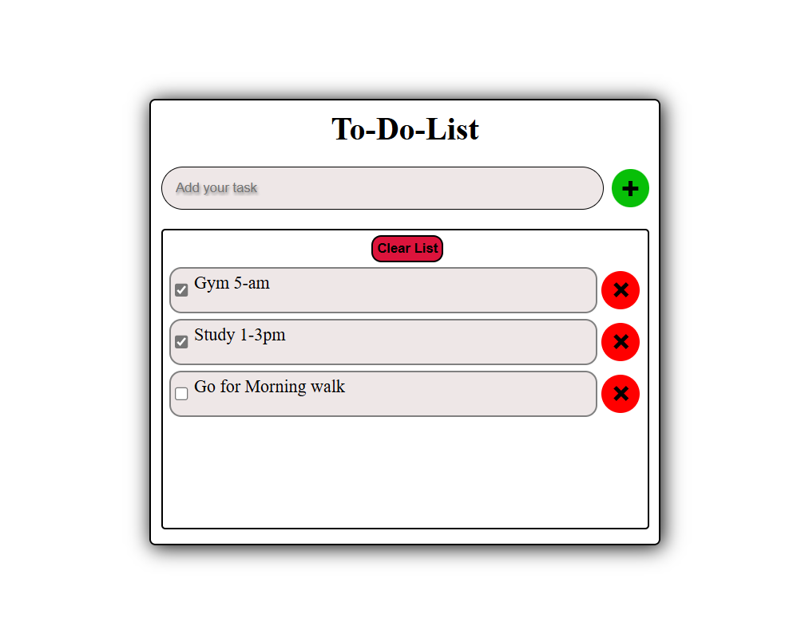

# ToDo-app 
 A simple task management app built with HTML, CSS, and JavaScript. This app allows users to add, remove, and clear all tasks, with data persistence using local storage. Stay organized by keeping track of your tasks even after page reloads. The app offers an intuitive interface to manage your daily to-dos with ease.

## 🚀 Features
- Add, edit, and delete tasks  
- Saves tasks using *local storage*  
- Responsive design  

## 📷 Screenshot  
  

## 📦 Installation  
1. Clone the repository:  
   ```bash
   git clone https://github.com/your-username/ToDo-app.git

2. Open index.html in a browser.

## 🔗Live Demo Link
[Click here to use the ToDo-app](https://akashbhardwaj0703.github.io/ToDo-app/)
    
